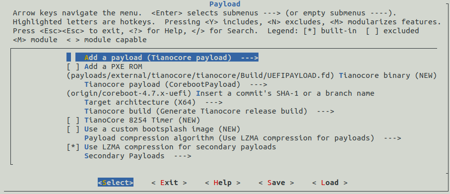

pce-fw-builder
==============

[](https://travis-ci.com/pcengines/pce-fw-builder)

This project aims to provide infrastructure for reliable building firmware for
PC Engines platforms. It replace legacy approach from
[release_manifests](https://github.com/pcengines/release_manifests) and utilize
official [coreboot-sdk](https://hub.docker.com/r/coreboot/coreboot-sdk/)
wherever it is possible. Unfortunately legacy builds `coreboot-4.0.x` require
toolchain from pre-coreboot-sdk era that's why we created
`pce-fw-builder-legacy`.

Limitations
------------

- Only the newest firmware releases are supported with pce-fw-builder. Versions
  v4.6.9 or newer and v4.0.17 or newer are compatible. Older releases are only
  compatible with legacy release manifests.

- It is advised to use tagged versions since they should not cause any build
  troubles.

- To customize the image, build from tagged version first, then use `dev-build`,
  see `Usage` and `Development use case` below

Usage
-----

Initial run may take some time. Below procedures assume that Docker is
correctly installed and current user is in `docker` group. Script automatically
detect with which codebase it deals with and choose toolchain accordingly.

```
$ git clone https://github.com/pcengines/pce-fw-builder.git -b <most_recent_tag>
```
Remember to use a recent tag in the command above.
```
$ cd pce-fw-builder
$ ./build.sh
usage: ./build.sh <command> [<args>]

Commands:
    dev-build    build PC Engines firmware from given path
    release      build PC Engines firmware from branch/tag/commit of
                 upstream or PC Engines fork of coreboot
    release-CI   release command prepared to be run in Gitlab CI

dev-build: ./build.sh dev-build <path> <platform> [<menuconfig_param>]
    <path>                full path to coreboot source
    <platform>            apu1, apu2, apu3, apu4 or apu5
    <menuconfig_param>    menuconfig interface, give 'help' for more information

release: ./build.sh release <ref> <platform> [<menuconfig_param>]
    <ref>                 valid reference branch, tag or commit
    <platform>            apu1, apu2, apu3, apu4 or apu5
    <menuconfig_param>    menuconfig interface, give 'help' for more information

```

Development use case
--------------------

This repository can be very useful for developers. First there is `dev-build`
which will build coreboot tree according to provided revision, but assuming you
starting from scratch and want to work with release version `v4.6.x` for apu2
you can simply:

```
./build.sh release v4.6.x apu2
```

This will pull everything needed and build release. Then you can play with code in `release/coreboot` and for rebuild simply:

```
./build.sh dev-build $PWD/release/coreboot apu2
```

Building Docker image
---------------------

### Mainline

```
docker build -t pcengines/pce-fw-builder -f Dockerfile.ml .
```

### Legacy

```
docker build -t pcengines/pce-fw-builder-legacy -f Dockerfile.legacy .
```
Building coreboot with Tianocore payload
---------------------

In this example coreboot v4.11.0.6 is build for apu2 platform, 
but release version and platform can be changed.

1. Clone the pce-fw-builder

2. Pull or build docker container:


3. Build image.

  ```
  ./build.sh release v4.11.0.6 apu2
  ```

4. Invoke distclean:

  ```
  ./build.sh dev-build $PWD/release/coreboot apu2 distclean
  ```

5. Copy config file for target platform

  ```
  cp $PWD/release/coreboot/configs/config.pcengines_apu2 $PWD/release/coreboot/.config
  ```

6. Create full config:

  ```
  ./build.sh dev-build $PWD/release/coreboot apu2 olddefconfig
  ```

7. Invoke menuconfig:

  ```
  ./build.sh dev-build $PWD/release/coreboot apu2 menuconfig
  ```

8. In menuconfig go to `Payload` menu and next:

  - In `Add a payload` choose *Tianocore coreboot payload package*
  - Deselect PXE ROM
  - Select Tianocore build type release
  - In `Secondary Payloads` disable all options
  - Make sure that Tianocore revision is set to 
  `origin/coreboot-4.7.x-uefi` in the
  `Insert a commit’s SHA-1 or a branch name` line.
  - Rest options in `Payload` menu leave default
  - Save settings and leave menuconfig
  ### Screenshot from correctly filled Payloads menu:
   

  
9. Build coreboot image

  ```
  ./build.sh dev-build $PWD/release/coreboot apu2 CPUS=$(nproc)
  ```

10. After successful build coreboot image file is in `release/coreboot/build`
directory.


Versioning
----------

PC Engines firmware builder repository will be versioned and tagged according
to coreboot's SDK versioning, i.e. pce-fw-builder adapts the major and minor
versions. PC Engines firmware versions will be added as a patch version, for
example:

coreboot/coreboot-sdk:1.52 release ===> pcengines/pce-fw-builder:1.52.1 release

### Version update

Using 3mdeb [docker-release-manager](https://github.com/3mdeb/docker-release-manager):

```
curl -s https://raw.githubusercontent.com/3mdeb/docker-release-manager/master/release-manager.sh | bash /dev/stdin bump_patch
```

If the coreboot-sdk container minor version increases by 2, manually set
`VERSION` file to correct value.

### Legacy builder

pce-fw-builder-legacy has frozen toolchain, thus the versioning should be.
Container will not have new tags.


Issues
------

If you want to create an issue, [here](https://github.com/pcengines/apu2-documentation/issues)
is the right place for that.